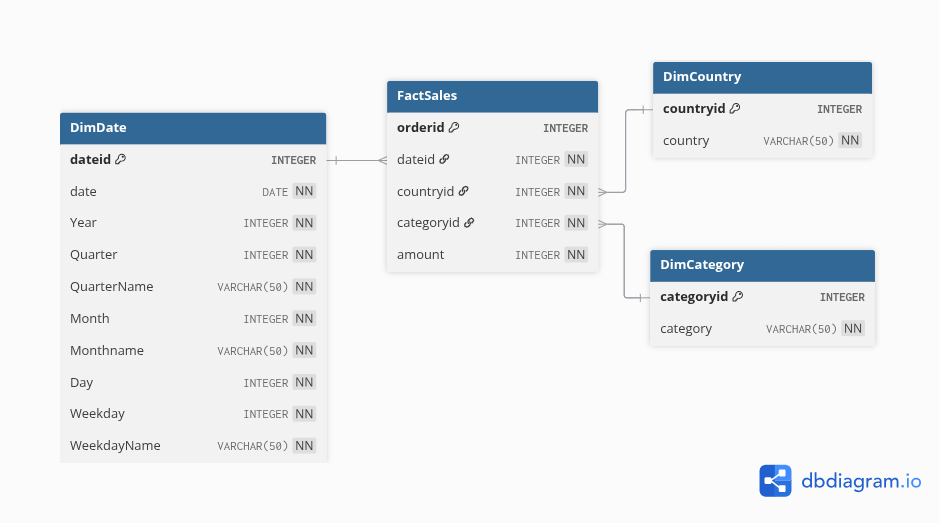

# 🏢 **3. Build Data Warehouse Using PostgreSQL**

This phase involves designing and creating the **data warehouse schema** for efficient reporting and analytics.


## 🎯 **Objectives**

✅ Design a **star schema** for the data warehouse

✅ Create dimension and fact tables

✅ Establish relationships for analytical queries


## 📝 **Data Warehouse Design**



The e-commerce company requires a data warehouse to analyze:

* **Total sales per year per country**
* **Total sales per month per category**
* **Total sales per quarter per country**
* **Total sales per category per country**

### **Schema Design Approach**

Design a **star schema** comprising:

* **Dimension Tables**: Date, Category, Country
* **Fact Table**: Sales


### 📅 **1. Design `DimDate` Table**

Granularity: **Daily**, with fields for year, quarter, month, weekday, etc.

```sql
CREATE TABLE IF NOT EXISTS public."DimDate" (
    dateid        INTEGER     PRIMARY KEY,
    date          DATE        NOT NULL,
    "Year"        INTEGER     NOT NULL,
    "Quarter"     INTEGER     NOT NULL,
    "QuarterName" VARCHAR(50) NOT NULL,
    "Month"       INTEGER     NOT NULL,
    "Monthname"   VARCHAR(50) NOT NULL,
    "Day"         INTEGER     NOT NULL,
    "Weekday"     INTEGER     NOT NULL,
    "WeekdayName" VARCHAR(50) NOT NULL
);
```


### 🗂️ **2. Design `DimCategory` Table**

```sql
CREATE TABLE IF NOT EXISTS public."DimCategory" (
    categoryid  INTEGER     PRIMARY KEY,
    category    VARCHAR(50) NOT NULL
);
```


### 🌎 **3. Design `DimCountry` Table**

```sql
CREATE TABLE IF NOT EXISTS public."DimCountry" (
    countryid   INTEGER     PRIMARY KEY,
    country     VARCHAR(50) NOT NULL
);
```


### 💰 **4. Design `FactSales` Table**

Contains foreign keys referencing dimension tables for analytical joins.

```sql
CREATE TABLE IF NOT EXISTS public."FactSales" (
    orderid     INTEGER     PRIMARY KEY,
    dateid      INTEGER     NOT NULL,
    countryid   INTEGER     NOT NULL,
    categoryid  INTEGER     NOT NULL,
    amount      INTEGER     NOT NULL,
    FOREIGN KEY (dateid)     REFERENCES public."DimDate"(dateid),
    FOREIGN KEY (countryid)  REFERENCES public."DimCountry"(countryid),
    FOREIGN KEY (categoryid) REFERENCES public."DimCategory"(categoryid)
);
```


### 🔗 **5. Design Relationships**

* **One-to-many** relationships from dimension tables to `FactSales`
* Ensure referential integrity across schema tables


## 🛠️ **Create the Data Warehouse Schema**

Download and run the [schema.sql](03_dwh/scripts/schema.sql) file to create all tables and relationships in PostgreSQL.


## 🗂️ **Project Phases**

🔗 **Next Steps:**

1. [Setup OLTP database using MySQL](../01_oltp/01_oltp.md)
2. [Setup NoSQL database using MongoDB](../02_nosql/02_nosql.md)
3. ✅ Build Data Warehouse using PostgreSQL
4. [Create Business Intelligence Dashboard using Tableau](../04_analytics/04_analytics.md)
5. [Create ETL Data Pipelines using Apache Airflow](../05_etl/05_etl.md)
6. [Perform Big Data Analytics with Apache Spark](../06_spark/06_spark.md)


