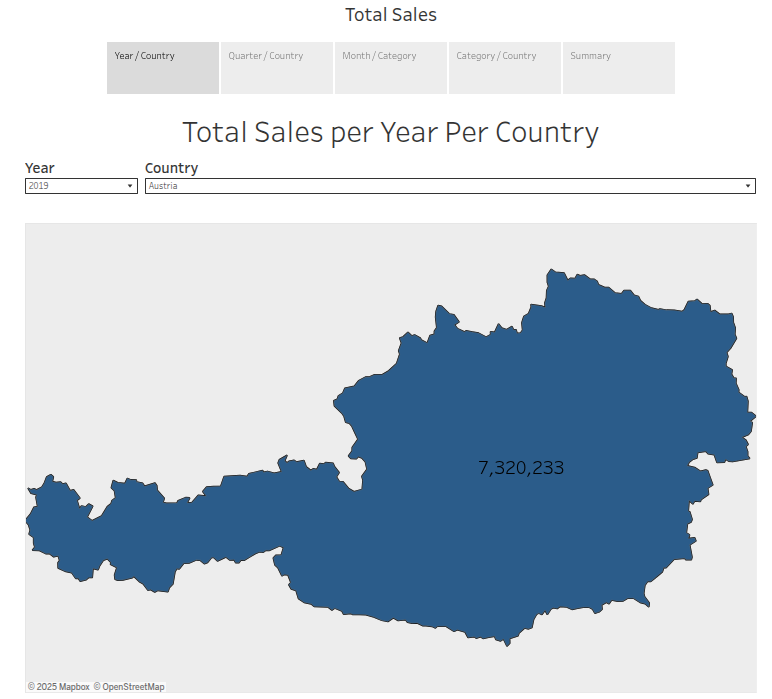
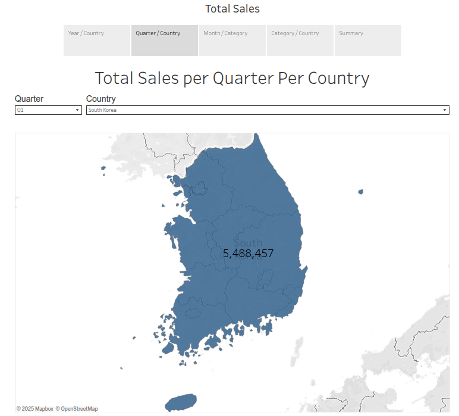
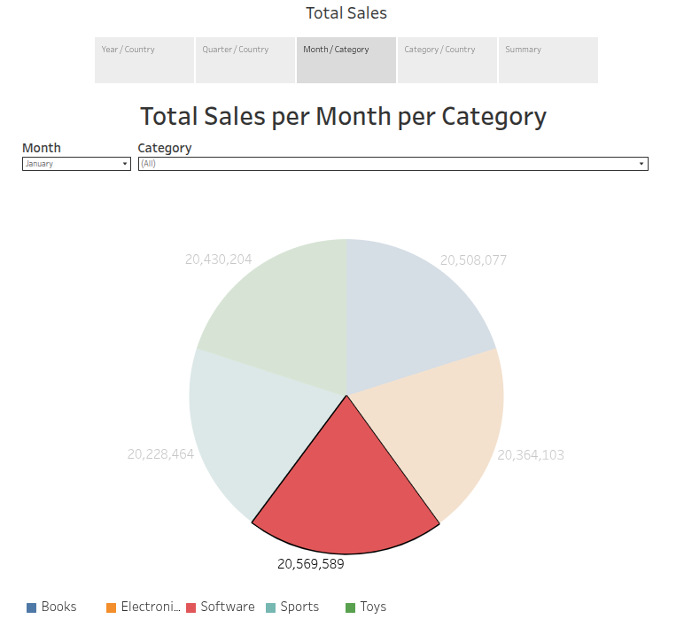
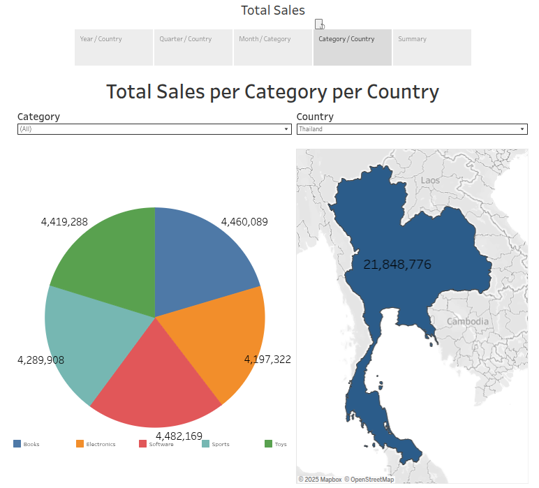
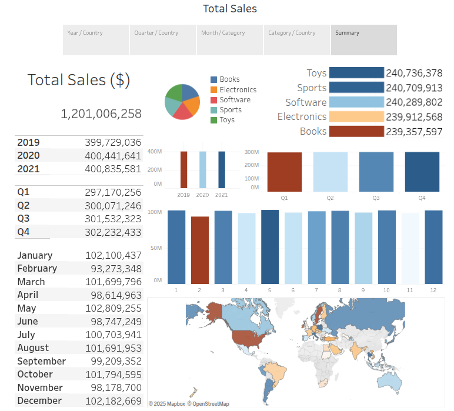

# 📊 **4. Create Business Intelligence (BI) Dashboard Using Tableau**

This phase focuses on **loading data** into the data warehouse and building **interactive dashboards** for e-commerce sales analysis.


## 🎯 **Objectives**

✅ Load data into **dimension** and **fact tables**

✅ Run analytical SQL queries

✅ Create dashboards in **Tableau**


## 🗃️ **Data Warehouse Reporting**

The e-commerce company retails digital products globally and requires insights from their data warehouse containing:

* `DimDate`
* `DimCategory`
* `DimCountry`
* `FactSales`


## 🛠️ **Loading Data into Tables**

### 1. Load `DimDate` Data

[Download DimDate.csv](https://cf-courses-data.s3.us.cloud-object-storage.appdomain.cloud/IBM-DB0321EN-SkillsNetwork/datawarehousing/data/DimDate.csv) and load into `DimDate`.

```sql
SELECT * FROM "DimDate" LIMIT 5;
 dateid |    date    | Year | Quarter | QuarterName | Month | Monthname | Day | Weekday | WeekdayName 
--------+------------+------+---------+-------------+-------+-----------+-----+---------+-------------
      1 | 2019-01-01 | 2019 |       1 | Q1          |     1 | January   |   1 |       3 | Tuesday
      2 | 2019-01-02 | 2019 |       1 | Q1          |     1 | January   |   2 |       4 | Wednesday

SELECT COUNT(*) FROM "DimDate";
 count 
-------
  1096
```


### 2. Load `DimCategory` Data

[Download DimCategory.csv](https://cf-courses-data.s3.us.cloud-object-storage.appdomain.cloud/IBM-DB0321EN-SkillsNetwork/datawarehousing/data/DimCategory.csv) and load into `DimCategory`.

```sql
SELECT * FROM "DimCategory";
 categoryid |  category   
------------+-------------
          1 | Electronics
          2 | Books
          3 | Toys
          4 | Sports
          5 | Software

SELECT COUNT(*) FROM "DimCategory";
 count 
-------
     5
```

### 3. Load `DimCountry` Data

[Download DimCountry.csv](https://cf-courses-data.s3.us.cloud-object-storage.appdomain.cloud/IBM-DB0321EN-SkillsNetwork/datawarehousing/data/DimCountry.csv) and load into `DimCountry`.

```sql
SELECT * FROM "DimCountry" LIMIT 5;
 countryid |  country   
-----------+------------
         1 | Argentina
         2 | Australia
         3 | Austria
         4 | Azerbaijan
         5 | Belgium

SELECT COUNT(*) FROM "DimCountry";
 count 
-------
    56
```


### 4. Load `FactSales` Data

[Download FactSales.csv](https://cf-courses-data.s3.us.cloud-object-storage.appdomain.cloud/IBM-DB0321EN-SkillsNetwork/datawarehousing/data/FactSales.csv) and load into `FactSales`.

```sql
SELECT * FROM "FactSales" LIMIT 5;
 orderid | dateid | countryid | categoryid | amount 
---------+--------+-----------+------------+--------
       1 |      1 |         6 |          4 |   5190
       2 |      1 |        25 |          2 |   1205
       3 |      1 |        22 |          5 |   3155
       4 |      1 |        40 |          2 |    268
       5 |      1 |        28 |          3 |   3199

SELECT COUNT(*) FROM "FactSales";
 count  
--------
 300000
```


## 📈 **Key Analytical Queries**

Here are some essential queries used to drive BI insights:

### 🔹 **Total Sales**

```sql
SELECT SUM(amount) AS total_sales FROM "FactSales";
```

💡 **Result**: \$1,201,006,258


### 🔹 **Top Categories**

```sql
SELECT cat.category, SUM(fs.amount) AS total_sales
FROM "FactSales" fs
JOIN "DimCategory" cat ON fs.categoryid = cat.categoryid
GROUP BY cat.category
ORDER BY total_sales DESC;
```

✅ **Top Category**: Toys (\$240,736,378)


### 🔹 **Top Countries**

```sql
SELECT dc.country, SUM(fs.amount) AS total_sales
FROM "FactSales" fs
JOIN "DimCountry" dc ON fs.countryid = dc.countryid
GROUP BY dc.country
ORDER BY total_sales DESC;
```

✅ **Top Country**: Thailand (\$21,848,776)


### 🔹 **Top Months**

```sql
SELECT dd."Monthname", SUM(fs.amount) AS total_sales
FROM "FactSales" fs
JOIN "DimDate" dd ON fs.dateid = dd.dateid
GROUP BY dd."Monthname"
ORDER BY total_sales DESC;
```

✅ **Top Month**: May (\$102,809,255)


### 🔹 **Top Quarters**

```sql
SELECT dd."QuarterName", SUM(fs.amount) AS total_sales
FROM "FactSales" fs
JOIN "DimDate" dd ON fs.dateid = dd.dateid
GROUP BY dd."QuarterName"
ORDER BY total_sales DESC;
```

✅ **Top Quarter**: Q4 (\$302,232,433)


### 🔹 **Top Years**

```sql
SELECT dd."Year", SUM(fs.amount) AS total_sales
FROM "FactSales" fs
JOIN "DimDate" dd ON fs.dateid = dd.dateid
GROUP BY dd."Year"
ORDER BY total_sales DESC;
```

✅ **Top Year**: 2021 (\$400,835,581)


### 🔹 **Grouping Sets, Rollups, and Cubes**

Performed advanced queries to analyze combinations of **country, category, and year**, using:

* `GROUPING SETS`
* `ROLLUP`
* `CUBE`

### 🔹 **Grouping sets query**

Create a grouping sets query using the columns `country`, `category`, `total_sales`.

```sql
SELECT 
    dc.country,
    cat.category,
    SUM(fs.amount) AS total_sales
FROM 
    "FactSales" fs
JOIN 
    "DimCountry" dc ON fs.countryid = dc.countryid
JOIN 
    "DimCategory" cat ON fs.categoryid = cat.categoryid
GROUP BY 
    GROUPING SETS (
        (dc.country, cat.category),
        (dc.country),
        (cat.category),
        ()
    )
ORDER BY 
    total_sales DESC;
```
✅ **Peru** has the highest **Electronics** category sales ($4,491,006) while **United States** has the lowest **Books** category sales ($4,087,113)

### 🔹 **Create a cube query**

Create a cube query using the columns `"Year"`, `country`, and `average sales`.
```sql
SELECT 
    dd."Year",
    dc.country,
    AVG(fs.amount) AS avg_sales
FROM 
    "FactSales" fs
JOIN 
    "DimDate" dd ON fs.dateid = dd.dateid
JOIN 
    "DimCountry" dc ON fs.countryid = dc.countryid
GROUP BY 
    CUBE (dd."Year", dc.country)
ORDER BY 
    dd."Year", avg_sales DESC;
```
✅ Highest average sales in **2019** was in **Bulgaria** ($4,088) while lowest average sales over all years was in **Sweden** ($3,910)


### 🔹 **Materialized Query Tables (MQTs)**

Created an MQT for **total sales per country** for fast retrieval.

```sql
CREATE MATERIALIZED VIEW total_sales_per_country AS
SELECT 
    dc.country,
    SUM(fs.amount) AS total_sales
FROM 
    "FactSales" fs
JOIN 
    "DimCountry" dc ON fs.countryid = dc.countryid
GROUP BY 
    dc.country;

SELECT * FROM total_sales_per_country 
ORDER BY total_sales DESC;
```
✅ Highest total sales was in **Thailand** ($21,848,776) while lowest total sales was in **Sweden** ( $21,000,525)


## Queries for reports requested by the company
- Total sales per year per country
- Total sales per month per category
- Total sales per quarter per country
- Total sales per category per country

### Total sales per year per country
```sql
SELECT 
    dd."Year",
    dc.country,
    SUM(fs.amount) AS total_sales
FROM 
    "FactSales" fs
JOIN 
    "DimDate" dd ON fs.dateid = dd.dateid
JOIN 
    "DimCountry" dc ON fs.countryid = dc.countryid
GROUP BY 
    ROLLUP (dd."Year", dc.country)
ORDER BY 
    dd."Year", total_sales DESC;
```
✅ Highest total sales in 2019 was in **Austria** (\$7,320,233)

### Total sales per month per category
```sql
SELECT 
    dd."Monthname",
    cat.category,
    SUM(fs.amount) AS total_sales
FROM 
    "FactSales" fs
JOIN 
    "DimDate" dd ON fs.dateid = dd.dateid
JOIN 
    "DimCategory" cat ON fs.categoryid = cat.categoryid
GROUP BY 
    ROLLUP (dd."Month", dd."Monthname", cat.category)
ORDER BY 
    dd."Month", total_sales DESC;
```

✅ **Software** gained the top category in **January** for all years (\$20,569,589)


### Total sales per quarter per country
```sql
SELECT 
    dd."QuarterName",
    dc.country,
    SUM(fs.amount) AS total_sales
FROM 
    "FactSales" fs
JOIN 
    "DimDate" dd ON fs.dateid = dd.dateid
JOIN 
    "DimCountry" dc ON fs.countryid = dc.countryid
GROUP BY 
    ROLLUP (dd."QuarterName", dc.country)
ORDER BY 
    dd."QuarterName", total_sales DESC;
```

✅ **South Korea** had the highest total sales in the first quarter (**Q1**) for all years was in  (\$5,488,457)


### Total sales per category per country
```sql
SELECT 
    cat.category,
    dc.country,
    SUM(fs.amount) AS total_sales
FROM 
    "FactSales" fs
JOIN 
    "DimCategory" cat ON fs.categoryid = cat.categoryid
JOIN 
    "DimCountry" dc ON fs.countryid = dc.countryid
GROUP BY 
    ROLLUP (cat.category, dc.country)
ORDER BY 
    cat.category, total_sales DESC;
```

✅ **Thailand** had the highest total sales in **Books** (\$4.460,089)


💡 See full SQL queries in the scripts section for [detailed  analysis](../04_analytics/scripts/detailed_analysis_queries.sql).


## 📊 **Build BI Dashboard in Tableau**

1. Visualize total sales trends by **year, month, quarter, category, and country**.
2. Design interactive dashboards for business users.

|  |  |  |  |
| ----------- | ----------- | ----------- | ----------- |



🔗 **[View E-Commerce Sales Dashboard](https://public.tableau.com/shared/WQKNR5C6J)**


## 🗂️ **Project Phases**

🔗 **Next Steps:**

1. [Setup OLTP database using MySQL](../01_oltp/01_oltp.md)
2. [Setup NoSQL database using MongoDB](../02_nosql/02_nosql.md)
3. [Build Data Warehouse using PostgreSQL](../03_dwh/03_dwh.md)
4. ✅ Create Business Intelligence Dashboard using Tableau
5. [Create ETL Data Pipelines using Apache Airflow](../05_etl/05_etl.md)
6. [Perform Big Data Analytics with Apache Spark](../06_spark/06_spark.md)


