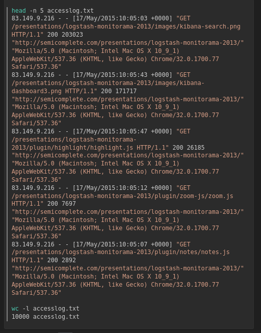
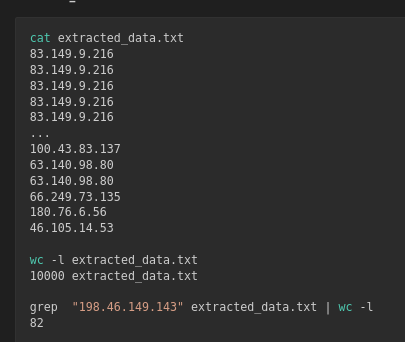
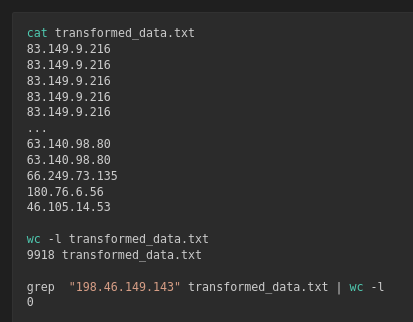
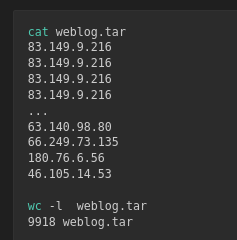
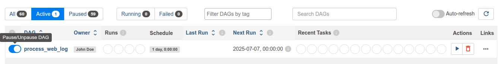
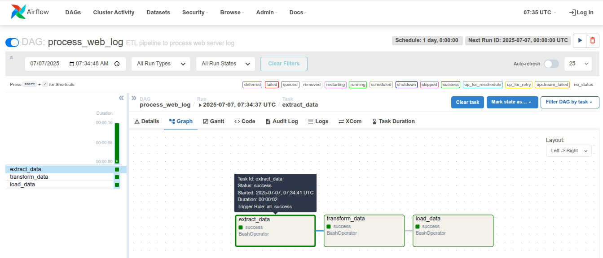

#  🛠️  ETL Data Pipelines using Apache Airflow

This phase focuses on building automated ETL pipelines to extract data, transform it, and load it with daily incremental updates.


## Objectives

✅ Extract data from OLTP databases

✅ Transform data to match data warehouse schema

✅ Load transformed data into the data warehouse

✅ Automate daily incremental data loads using Airflow


## ETL Pipeline Overview

1. **Daily synchronization** between staging (MySQL) and production (PostgreSQL) data warehouses
2. **Incremental loading** by identifying new rows based on `rowid`
3. **Automation** of ETL tasks using Python scripts and Airflow DAGs


## 🔗 ETL with Python

### 1. Data Extraction

* Extract daily sales data from MySQL `sales_data` table into CSV format.

### 2. Data Transformation

* Read extracted CSVs
* Modify columns to fit the data warehouse schema
* Save as transformed CSV files

### 3. Data Loading

* Load transformed data into PostgreSQL `sales_data` table
* Verify row counts to ensure successful loads


## ⚙️ Automation Setup

### Environment Preparation

```bash
# Start MySQL and create the sales database
mysql -u root -p
CREATE DATABASE sales;
exit

# Import data
mysql -u root sales < sales.sql

# Install Python connectors
python -m pip install mysql-connector-python psycopg2
```


### Python Scripts

| Script                 | Description                                 |
| ---------------------- | ------------------------------------------- |
| [mysqlconnect.py](../05_etl/scripts/05_1_etl_dwh/mysqlconnect.py)      | Connects to MySQL staging warehouse         |
| [postgresqlconnect.py](../05_etl/scripts/05_1_etl_dwh/postgresqlconnect.py) | Connects to PostgreSQL production warehouse |
| [automation.py](../05_etl/scripts/05_1_etl_dwh/automation.py)        | Automates ETL tasks                      |


### Core Functions in `automation.py`

* `get_last_rowid()`
  Retrieves last `rowid` from PostgreSQL.

* `get_latest_records()`
  Fetches new records from MySQL based on last `rowid`.

* `insert_records()`
  Inserts new records into PostgreSQL.


### Execution Example

```bash
python automation.py

# Output
Last row id on production data warehouse = 12289
New rows on staging data warehouse = 1650
New rows inserted into production data warehouse = 1650
```

✅ PostgreSQL row count updated to match MySQL staging.


## 🗂️ Automating with Apache Airflow

### Purpose

* Automate ETL pipelines
* Schedule and monitor data workflows


### DAG: Process Web Server Logs

1. **Extract** IP addresses from log file
2. **Transform**: filter out a specific IP (e.g., `198.46.149.143`)
3. **Load** transformed data into a tar archive


### Setup

```bash
# Download dataset
wget https://cf-courses-data.s3.us.cloud-object-storage.appdomain.cloud/IBM-DB0321EN-SkillsNetwork/ETL/accesslog.txt
```


### Base directory
```bash
mkdir -p /home/project/airflow/dags/base
cp accesslog.txt /home/project/airflow/dags/base
```


### DAG definition [process_web_log.py](../05_etl/scripts/05_2_pipelines_airflow/process_web_log.py)

```python
default_args = {
    'owner': 'John Doe',
    'start_date': days_ago(0),
    'email': ['john.doe@example.com'],
    'retries': 1,
    'retry_delay': timedelta(minutes=5)
}

dag = DAG(
    'process_web_log',
    default_args=default_args,
    description='ETL pipeline to process web server log',
    schedule_interval=timedelta(days=1)
)
```


### Tasks

| Task             | Action                           |
| ---------------- | -------------------------------- |
| `extract_data`   | Extract IPs from [accesslog.txt](../05_etl/data/05_2_pipelines_airflow/accesslog.txt) into [extracted_data.txt](../05_etl/data/05_2_pipelines_airflow/extracted_data.txt) |
| `transform_data` | Filter out blocked IP and save unblocked to [transformed_data.txt](../05_etl/data/05_2_pipelines_airflow/transform_data.txt) |
| `load_data`      | Archive transformed data into [weblog.tar](../05_etl/data/05_2_pipelines_airflow/weblog.tar) |

### Pipeline
```python
extract_data >> transform_data >> load_data
```

 

### Deployment

```bash
# Copy DAG to Airflow
cp process_web_log.py $AIRFLOW_HOME/dags
```

### Unpause DAG
Using CLI
```bash
airflow dags unpause process_web_log
```
Using Airflow UI


# Confirm DAG is active
```bash
airflow dags list | grep "process_web_log"
```


### Monitoring

### **Airflow UI**

Check DAG Runs, Graph View, and Logs for successful task completion.

#### List Dag Run


#### Graph view



## 🗂️ **Project Phases**

🔗 **Next Steps:**

1. [OLTP database setup with MySQL](../01_oltp/01_oltp.md)
2. [NoSQL database setup with MongoDB](../02_nosql/02_nosql.md)
3. [Data warehouse build with PostgreSQL](../03_dwh/03_dwh.md)
4. [BI Dashboard with Tableau](../04_analytics/04_analytics.md)
5. ✅ ETL Pipelines with Apache Airflow
6. [Perform Big Data Analytics with Apache Spark](../06_spark/06_spark.md)


