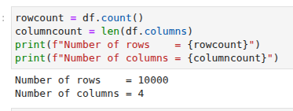

# 📄  Perform Big Data Analytics with Apache Spark

This phase focuses on analyzing search data and deploying a sales forecasting model using SparkML.


## 🎯 Objectives

✅ Analyze e-commerce web server search terms

✅ Load and deploy a pretrained sales forecasting model

✅ Predict sales forecasts for future years using SparkML


## ⚙️ Spark Big Data Analytics Workflow

### 1. Analyze Search Terms Data

Use data provided by the company:

**Dataset:** [searchterms.csv](../06_spark/data/searchterms.csv)

```bash
head searchterms.csv 
day,month,year,searchterm
12,11,2021,mobile 6 inch
12,11,2021,mobile latest
...
wc -l searchterms.csv
10000 searchterms.csv
```


### 2. Load Data into Spark DataFrame

```python
df = spark.read.csv("searchterms.csv", header=True, inferSchema=True)
```


### 3. Data Exploration

✅ **Print number of rows and columns**



✅ **Display top 5 rows**


✅ **Check datatype of `searchterm` column**


✅ **Count occurrences of "gaming laptop"**


✅ **Find top 5 most frequently searched terms**


## 🤖 Machine Learning with SparkML

### 4. Load Pretrained Sales Forecast Model

* Download model archive:

```bash
wget https://cf-courses-data.s3.us.cloud-object-storage.appdomain.cloud/IBM-DB0321EN-SkillsNetwork/Bigdata%20and%20Spark/model.tar.gz
```


### 5. Deploy Sales Forecast Model

✅ Load and deploy the pretrained sales forecasting ML model using SparkML.


### 6. Predict Sales Forecast

✅ Execute the model on Spark cluster to predict sales for future years (e.g. **2023**).


## 💻 Notebook

All implementations are available in:

📓 [SparkML Ops Notebook](../06_spark/notebooks/spark_ml_ops.ipynb)


## 🗂️ **Project Phases**

🔗 **Summary:**

1. [OLTP database setup with MySQL](../01_oltp/01_oltp.md)
2. [NoSQL database setup with MongoDB](../02_nosql/02_nosql.md)
3. [Data warehouse build with PostgreSQL](../03_dwh/03_dwh.md)
4. [BI Dashboard with Tableau](../04_analytics/04_analytics.md)
5. [ETL Pipelines with Apache Airflow](../05_etl/05_etl.md)
6. Big Data Analytics with Apache Spark

