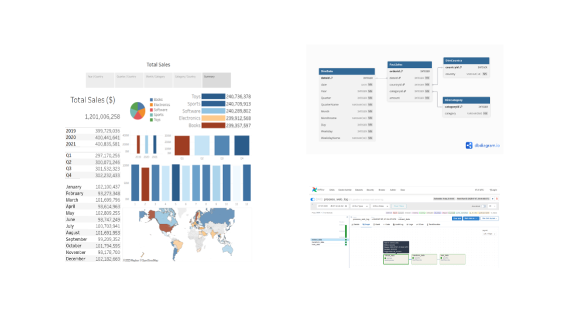
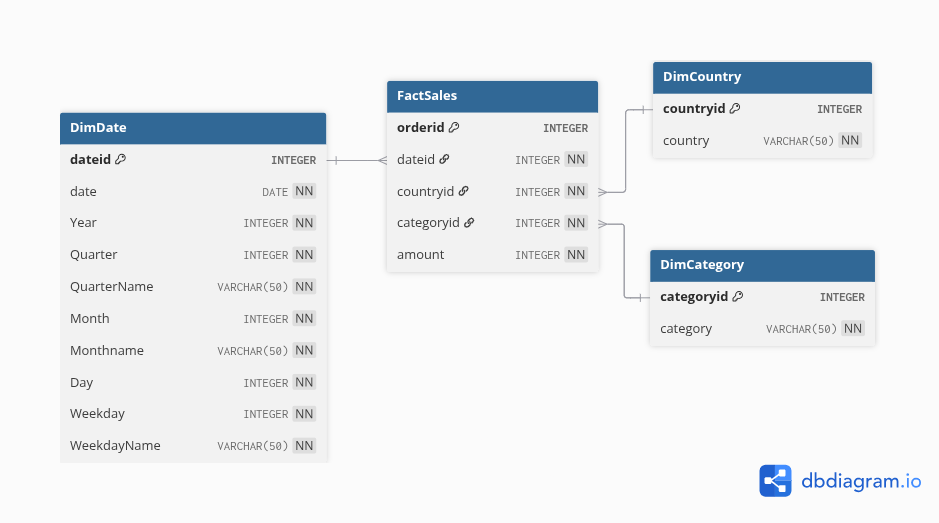
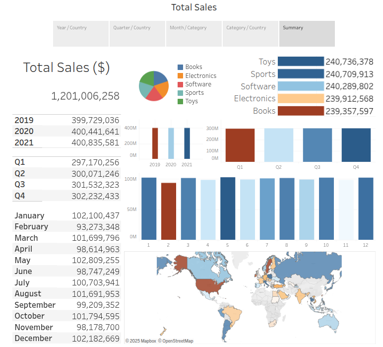
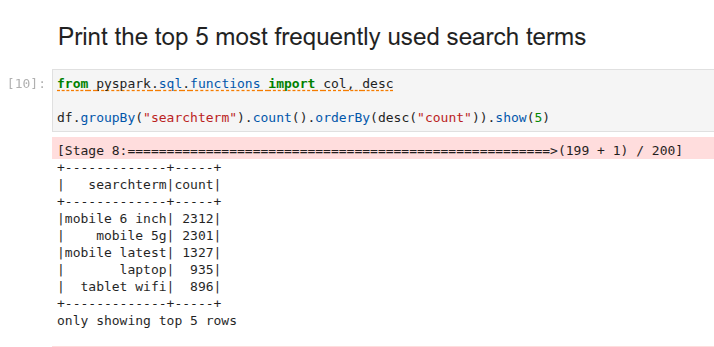

# 🛒 E-commerce Data Analytics Platform



A comprehensive data engineering project simulating an e-commerce analytics platform with end-to-end integration of OLTP, NoSQL, data warehousing, ETL pipelines, big data analytics, and BI dashboards.


## 🚀 **Project Overview**

This project demonstrates the design and implementation of a modern data platform for an e-commerce company whose online presence is driven entirely by:

* **Sales transactional data** stored in **MySQL**
* **Product catalog data** stored in **MongoDB**

To enable analytics and business intelligence:

* Data is periodically extracted from these databases into a **staging data warehouse**
* **ETL pipelines** orchestrated by **Apache Airflow** extract, transform and load the data
* **Apache Spark** is used for big data analytics and sales forecasting
* **Tableau dashboards** provide business insights for BI teams


## 💼 **Business Challenge**

Design and implement a robust data platform to integrate and analyze e-commerce data from multiple sources for operational reporting, business intelligence, and machine learning use cases.


## 🎯 **Project Objectives**

1. Design data repositories using **MySQL (OLTP)** and **MongoDB (NoSQL)** for transactional and catalog data
2. Build a **PostgreSQL data warehouse**, create fact and dimension tables, and perform **cube and rollup operations**
3. Develop **Tableau dashboards** to visualize key business metrics
4. Create **ETL pipelines with Apache Airflow** to extract, transform, and load data into the warehouse
5. Perform **big data analytics using Apache Spark**, deploying a machine learning model for sales forecasting


## 🗂️ **Project Phases**

### 1. [Setup OLTP Database (MySQL)](01_oltp/01_oltp.md)


* Design and populate the OLTP schema for sales data
* Automate periodic data exports


### 2. [Setup NoSQL Database (MongoDB)](02_nosql/02_nosql.md)


* Load e-commerce catalog data
* Query and manage product information in MongoDB


### 3. [Build Data Warehouse (PostgreSQL)](03_dwh/03_dwh.md)



* Design and implement the data warehouse schema
* Create fact and dimension tables for analytical queries


### 4. [Create Business Intelligence Dashboard (Tableau)](04_analytics/04_analytics.md)



* Load data into the data warehouse
* Build cubes and rollups
* Design dashboards to analyze sales performance across time, categories, and geographies


### 5. [Create ETL Pipelines (Apache Airflow)](05_etl/05_etl.md)


* Extract e-commerce web server log
* Transform data to exclude specific IP Address
* Load transformed data into tar file
* Automate incremental data loads using Airflow DAGs


### 6. [Perform Big Data Analytics (Apache Spark)](06_spark/06_spark.md)



* Analyze e-commerce search terms using Spark
* Deploy pretrained **sales forecasting models with SparkML**
* Predict future sales trends for business planning


## 🛠️ **Tools & Technologies**

| Purpose               | Tool           |
| --------------------- | -------------- |
| OLTP database         | MySQL          |
| NoSQL database        | MongoDB        |
| Data warehouse        | PostgreSQL     |
| Data pipelines        | Apache Airflow |
| Big data analytics    | Apache Spark   |
| Business intelligence | Tableau        |

---

## 📊 **Data**

The datasets used in this project are **synthetic** and were programmatically generated as part of the [IBM Data Engineering Capstone Project](https://www.coursera.org/learn/data-enginering-capstone-project) within the [IBM Data Engineering Professional Certificate](https://www.coursera.org/professional-certificates/ibm-data-engineer) on Coursera.


## 📎 **Repository Structure**

```
.
├── 01_oltp/        # MySQL OLTP setup
├── 02_nosql/       # MongoDB NoSQL setup
├── 03_dwh/         # PostgreSQL Data Warehouse
├── 04_analytics/   # Tableau Dashboards
├── 05_etl/         # Apache Airflow ETL pipelines
├── 06_spark/       # Apache Spark big data analytics
└── README.md       # Project README file
```

### ⭐ **If you find this project helpful, please star the repository to support its visibility.**